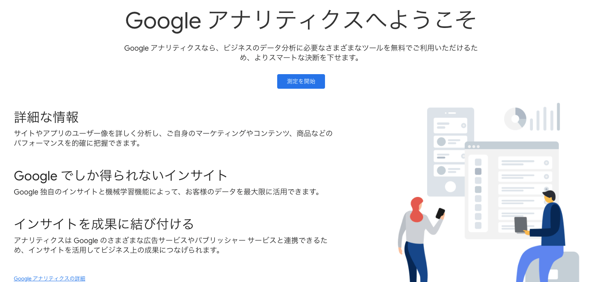
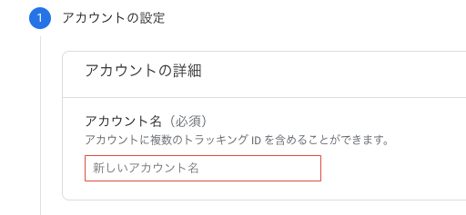
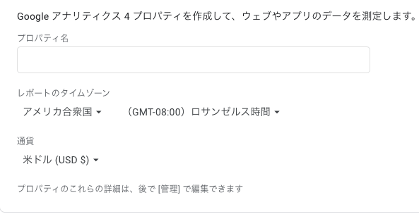
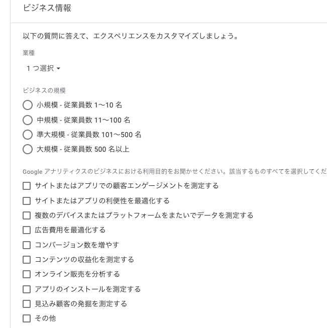
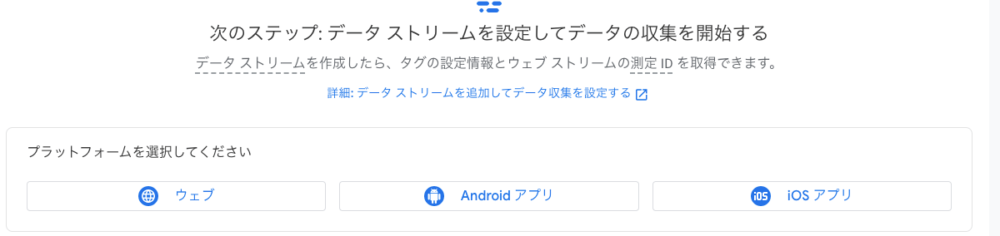
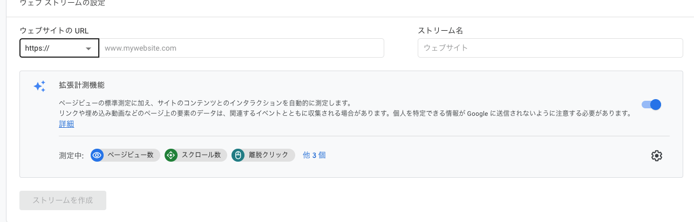

### 1. はじめに
Hugoで作った静的サイトはそのままの設定ではGoogle検索にはかからないので、いくつか設定をしないといけません。

### Google検索で表示されるまで
-----
1. [Google Analytics](https://analytics.google.com/analytics/web/)に登録
2. [Google Search Console](https://search.google.com/search-console/welcome?hl=ja)に登録

今回は *Google Analytics* 登録編です。

### 2. やってみる

測定を開始をクリック


任意のアカウント名にして**次へ**


- プロパティ(サイトやアプリの名前)
- タイムゾーン
- 通貨
を入力して**次へ**


上から順に記入していけば大丈夫です。


プラットフォームはwebを選択


webサイト のURLを入力します。このサイトでは`https:///public-jun.github.io`のようになります。
ストリーム名はwebサイトのタイトルを入力すれば大丈夫です。

ストリームを作成すると**測定ID**が生成されます。

### Hugoの設定
* * *
Hugoの場合、google analytics設定用のテンプレートが用意されているので**configファイル**に追記します。

`config.yml`:(Google Analytics v4 (gtag.js))の場合、測定IDが**G**からはじまる
```yml
googleAnalytics: G-MEASUREMENT_ID
```

`config.yml`:Google Analytics v3 (analytics.js)の場合、測定IDが**UA**からはじまる
```yml
googleAnalytics: UA-PROPERTY_ID
```
現在はgtagsで設定しておけば良いと思います。

これでHugo側の設定は完了です。
アップロードして確認してみましょう。

Google Analyticsの*レポート* -> *リアルタイム* を確認してみて、自分がアクセスしたときにユーザー数が0以外であれば成功です:smile:

### 最後に
次回はGoogle Search Consoleの設定をしてみたいと思いますがどうやら登録に時間がかかる場合もあるらしく、まだできていません。
登録出来次第まとめたいと思います。
