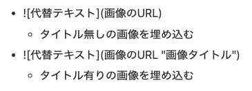

### 1. はじめに
Hugoで作った静的サイトはそのままの設定ではGoogle検索にはかからないので、いくつか設定をしないといけません。

### Google検索で表示されるまで
-----
1. [Google Analytics](https://analytics.google.com/analytics/web/)に登録
2. [Google Search Console](https://search.google.com/search-console/welcome?hl=ja)に登録

今回は *Google Analytics* 登録編です。

### 2. やってみる
aiu




### 1. はじめに
xxxx


### x. Markdown CheetSheet

#### Text Format

_Italic（斜体）_
*Italic（斜体）*

__Emphasis（強調）__
**Emphasis（強調）**

~~Strikethrough（取り消し線）~~

これは詳細表示の例です。
詳細をこっちに書きます。

This is `inline`.

### List
* text
    * test
    * test

- text
    - test
    - test

1. text
1. test
    1. test

#### Horizontal rules
* * *
***
*****
- - -
---------------------------------------

#### Blockquotes（引用）
> This is Blockquotes

#### Links（参照）

#### Images（画像）

#### Tables（表）
| id     | name    | date       |
| ------ | ------- | ---------- |
| 1      | test    | 2019-01-01 |
| 2      | test    | 2019-01-02 |
| 3      | test    | 2019-01-03 |
