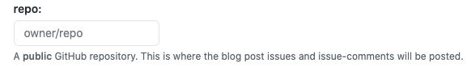
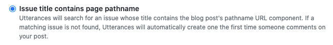
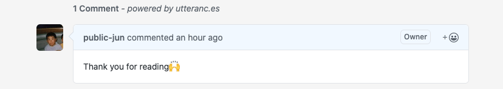

### 1. はじめに
Hugo でブログを作ってみたものの、デフォルトではコメント機能はついていません。

今回は[**Utterances**](https://utteranc.es/)を使ってみたいと思います。

### 2. Hugoのコメント機能
* * *
Hugo にコメント機能をつける場合、いくつか選択肢があります。

鉄板は [Disqus](https://disqus.com/) でしょうか。これは公式が Hugo をサポートしています。

[Docs](https://gohugo.io/content-management/comments/) にも唯一設定手順が書いてあります。

以下、ドキュメントに紹介されているもの
- [Cactus Comments](https://cactus.chat/docs/integrations/hugo/)
- [Commento](https://commento.io/)
- [Graph Comment](https://graphcomment.com/)
- [Hyvor Talk](https://talk.hyvor.com/)
- [IntenseDebate](https://intensedebate.com/)
- [Isso](https://posativ.org/isso/)
- [Muut](https://muut.com/)
- [Remark42](https://remark42.com/)
- [Staticman](https://staticman.net/)
- [Talkyard](https://www.talkyard.io/blog-comments)
- [Utterances](https://utteranc.es/)

Disqus を使わない理由は無料プランだと広告がつくみたいです。あと登録するのも少し面倒に感じました。

でも今回使う *Utterances* は GitHub のアカウントだけなので、(一応想定読者はテックの人なので) GitHub の認証のみならコメントのハードルも低いかなと思いこれに決めました。

あと見た目がいい:blush:

#### Utterancesとは？？
> A lightweight comments widget built on GitHub issues. Use GitHub issues for blog comments, wiki pages and more!

Utterances は軽量なコンポーネントと GitHub issues にコメントを書きこむ bot を提供しています。
これを使うと GitHub の issue と記事やページを紐付け、ページに issue を表示することができます。

OSS プロジェクトでスター6kついており、かなりの人が使っています。

テーマもいくつか用意されていて良きです。

トラックなし、広告なし、その上機能は全て無料です。

### 3. Utterancesの導入
* * *
今回は Utterances に絞って説明していきます。
前提として Hugo のサイトを GitHub の public なリポジトリで管理しているとします。
また使用テーマは *PaperMod* です。

基本的には[公式サイト](https://utteranc.es/)を見ながら設定していけば ok です。

1. リポジトリに [utterances app](https://github.com/apps/utterances) をインストール

2. フォームにリポジトリの所有者とリポジトリ名を入力

私の場合は `public-jun/public-jun.github.io` です。

3. 記事と GitHub の issue を紐付ける。今回は `pathname` で設定します。


4. GitHub の issue でのラベルを決める。これは任意のラベルで大丈夫です。今回はコメントと分かるように `Comment` とします。

5. テーマを決める。お好きなテーマを選んでください。

ここまですると一番したに設定用のスクリプトが表示されます。

これを `layout/partials/comments.html` 新たに作成し貼り付けます。
```html
<script
	src="https://utteranc.es/client.js"
	repo="owner/repo"
	issue-term="pathname"
	label="Comment"
	theme="github-light"
	crossorigin="anonymous" async>
</script>
```

`confing.yml`
```yml
params:
  comments: true
```

これを追記することで`themes/PaperMod/layouts/_default/single.html` の
```html
  {{- if (.Param "comments") }}
  {{- partial "comments.html" . }}
  {{- end }}
```
が有効となりコメントが表示されます。

### 4. コメントする
* * *
実際にコメントしてみるとこんな感じ


### 5. 最後に
これでいい感じにコメント機能が追加できたと思います。
もし読んでくださった方がいたら、コメントくれると嬉しいです:smile:

ダークモードとライトモードでテーマが切り替えられるようにしたいです。
明日はそろそろ取り組んでいる課題の記事にしていきたい。

### 参考URL
- https://utteranc.es/
- https://miyauchi.dev/ja/posts/comment-system/
- https://mscipio.github.io/post/utterances-comment-engine/
