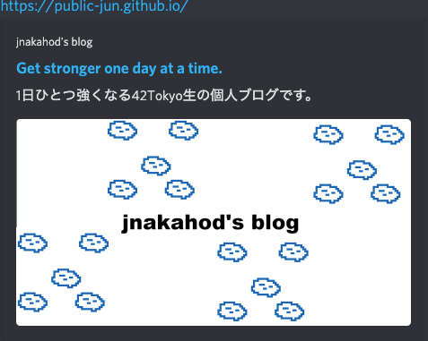

### 1. はじめに
Hugoで作ったサイトは共有された時、ブログカードはデフォルトでは作成されません。
ブログカードは下記の画像です。

タイトル、説明、画像といったものがのっています。
これらの情報を提供しているのが **Open Graph Protocol(OGP)** です。 

今回は**ブログカードの画像**を用意して、Hugo の **config ファイルに OGP の設定**を記述しブログカードを作成します。

### 2. Open Graph Protocol(OGP)、OGP 画像って何？？
* * *
[公式より](https://ogp.me/)
> The Open Graph protocol enables any web page to become a rich object in a social graph. For instance, this is used on Facebook to allow any web page to have the same functionality as any other object on Facebook.

OGP を用いると任意の Web ページをリッチなソーシャルグラフのオブジェクトにすることができます。

要するに、ページのブログカードに必要な情報を取ってきてブログカードを作る仕組みの一つです。

HTML の head 領域に任意のデータを記述できる meta 要素を追加し、ページ情報を記載することができます。OGP のデータであることを示すために、property 属性に *og:* から始まる値を記述します。

基本的に必要なのは以下の 4 つです。
- **og:title** ... ページのタイトル
- **og:type**... ページのオブジェクトタイプを表す、トップページは *website" 、それ以外は "article"
- **og:image**... ページの画像
- **og:url**...  ページのURL

この他にも
*og:site_name* や *og:description* もよく利用されます。

このブログのトップページのOGP設定は以下
```html
<head>
.
.
<meta property="og:title" content="Get stronger one day at a time.">
<meta property="og:description" content="1日ひとつ強くなる42Tokyo生の個人ブログです。">
<meta property="og:type" content="website">
<meta property="og:url" content="https://public-jun.github.io/">
<meta property="og:image" content="https://public-jun.github.io/first-blog-card-fs8.png">
<meta property="og:site_name" content="jnakahod's blog">
.
</head>
```

### 3. GIMPを使って画像作成
* * *
ドット絵の作成には[ミニドット絵メーカー3](https://neutralx0.net/tools/dot3/)、それを加工し編集するのに画像編集ソフト[GIMP](https://www.gimp.org/) を利用しました。

どちらも無料で使えます。
GIMP は OSS プロジェクトで有料サービスに劣らないくらい機能が盛り盛りだったのでびっくりしました。

### 4. configファイル設定
* * *
[Hugo には予め OGP 情報を head 内に埋め込む機能](https://gohugo.io/templates/internal/)がついているので、config ファイルを設定し有効にしていきます。

以下公式サイトの設定

*config.yml*
```yaml
params:
  description: Text about my cool site
  images:
  - site-feature-image.jpg
  title: My cool site
taxonomies:
  series: series
```
記事それぞれに情報を付与することも可能です。

*content/blog/my-post.yaml* もしくは front matter 内に記述
```yaml
audio: []
date: "2006-01-02"
description: Text about this post
images:
- post-cover.png
series: []
tags: []
title: Post title
videos: []
```

私の config.yaml の場合は以下の設定です。
```yaml
params:
  .
  .
  description: 1日ひとつ強くなる42Tokyo生の個人ブログです。
  images:
  - first-blog-card-fs8.png
  title: jnakahod's blog
```
Twitter カードもこれで設定できたことになります。

`layout/partials/head.html` もしくは `thema/テーマ名/layout/partials/head.html` の中の
```html
{{- template "partials/templates/opengraph.html" . }}
{{- template "partials/templates/twitter_cards.html" . }}
```
が有効になります。

ファイルの構成はテーマに依存するので、使用しているものに合わせて利用してください。ない場合は、追記してください。


### 5. ブログカード完成
これでデプロイすると冒頭のようなブログカードの完成です。

- [OGP確認](https://rakko.tools/tools/9/)

これを使うと各SNSにどのように共有されるのか確認できます。
###  最後に
***
これでとりあえず欲しい機能は揃ってきたので、あとは淡々とアウトプットを増やしてきます。
また Hugo で気になる機能があったら積極的に触ってみようと思います。


ではまた:wave:
