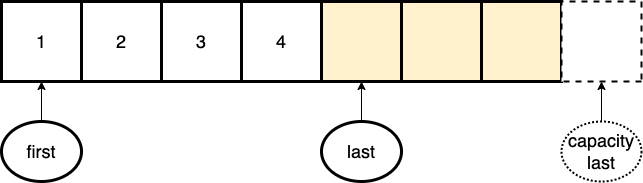

## 1. はじめに
* * *

c++98 で STL コンテナの vector(c++98 ver) を自作していきます。

完成形は [cppreferece](https://en.cppreference.com/w/cpp/container/vector) 、 [C++ Reference](https://www.cplusplus.com/reference/vector/vector/?kw=vector) の vector を目指します。

## 2. 基礎知識編
### コンテナ
* * *
クラスや構造体、基本型(int, charなど)を保持するデータ構造(入れ物)。

`vector` や `map` 、`stack` 、`set` などデータ保持の方法は、用途に合わせて様々なものが提供されています。
### イテレータ
* * *
コンテナの個々の要素を参照するためのクラスです。

この特徴から、イテレータは **ポインタを抽象化したクラス** と捉えることもできます。しかし、全てのイテレータがポインタの全機能を備えているわけではありません。

後述するアルゴリズムはコンテナのイテレータを用いて、コンテナを操作することができます。
イテレータがコンテナとアルゴリズムを媒介するインターフェースになることで、異なるデータ構造にも関わらす、コンテナを操作することができます。

イテレータを用いて要素の移動、参照、変更が行えます。
- ポインタのように `*iterator` と `*` をつけることで、要素への参照が可能です。
- `++iterator` とすると、次の要素を指します。

これらの操作はイテレータの種類によっても異なります。([wiki](https://ja.wikipedia.org/wiki/Standard_Template_Library)より)

1. InputIterator(入力イテレータ)
    - 要素への **読み取り専用** アクセスを提供するイテレータ。
    要素への読み取りが可能であれば、InputIterator とみなせます。(istream_iteratorなど)
2. OutputIterator(出力イテレータ)
    - 要素への **書き込み専用** アクセスを提供するイテレータ。
    要素への書き込みが可能であれば、OutputIterator とみなせます。(ostream_iteratorなど)
3. ForwardIterator(前方向イテレータ)
    - **一旦前に進めると、逆方向には戻れない** イテレータ。
    要素への読み取り、書き込みが可能であれば、ForwardIterator とみなせます。(単方向リストのコンテナのイテレータなど)
4. BidirectionalIterator(双方向イテレータ)
    - **前方、後方どちらにも進める** 機能を持つイテレータ。
    前方向イテレータの要件に加えて、デクリメント(- -)が可能であれば、 BidrectionalIterator とみなせます。(list、set、multiset、map、multimapのコンテナのイテレータなど)
5. RandomAccessIterator(ランダムアクセスイテレータ)
    - ポインタのように **ランダムにアクセスが行える** イテレータ。
    BidirectionalIterator の要件に加え、算術演算(+, -, +=, -=)が可能であれば RandomAccessIterator とみなせます。(vector、array、dequeのイテレータなど)

全てのイテレータはインクリメント(++)、等号比較(it1 != it2)、デリファレンス(*it)可能でなければならない。

また、入力イテレータ、前方向イテレータ、双方向イテレータ、ランダムアクセスイテレータは順に **継承関係** になっています。例えば、前方向イテレータは入力イテレータとみなすことができます。

### アルゴリズム 
* * *
コンテナのイテレータを引数として受け取り、コンテナの要素に対して操作を行う関数群です。
イテレータの範囲内から任意の値を検索する `std::find()` や イテレータの範囲を別のイテレータにコピーする `std::copy()` など様々なものがあります。

## 3. vector とは？？
* * *
`std::vector` は c++ で標準で使用することができる **動的配列(可変長配列)** クラスです。

通常の配列はサイズを予め指定する必要があり、実行時に動的にサイズを変更することができません。

一方、動的配列はサイズを **自由に増減** することができます。
保持する要素数に合わせて、サイズを変更できるのでメモリ領域を無駄に確保せずに済みます。

通常の配列と同じように各要素は連続して配置しているので、イテレータだけでなく、`[]演算子`で添字でアクセスすることが可能です。

***
`vector` のデータ構造は図のようになっており、実際の要素数(size)は `last - first` となり、要素をいれることができる領域(capacity) `capacity - first` になります。

メモリ領域の再確保は全ての要素が新しいメモリ領域にコピーされるため時間がかかります。`vector` は余分にメモリを確保することで、要素を追加する度にメモリを再確保する必要がなくなります。

要素数がcapacityを超える場合は、メモリ領域の再確保が行われます。

## 最後に
これらの特徴を押さえて次回は vector のイテレータ実装編です。

### 参考URL
- https://nafuka.hatenablog.com/entry/2021/11/15/184200
- https://note.com/syamashi/n/n55ee0dad207d
- http://vivi.dyndns.org/tech/cpp/vector.html
- https://ja.wikipedia.org/wiki/Standard_Template_Library
