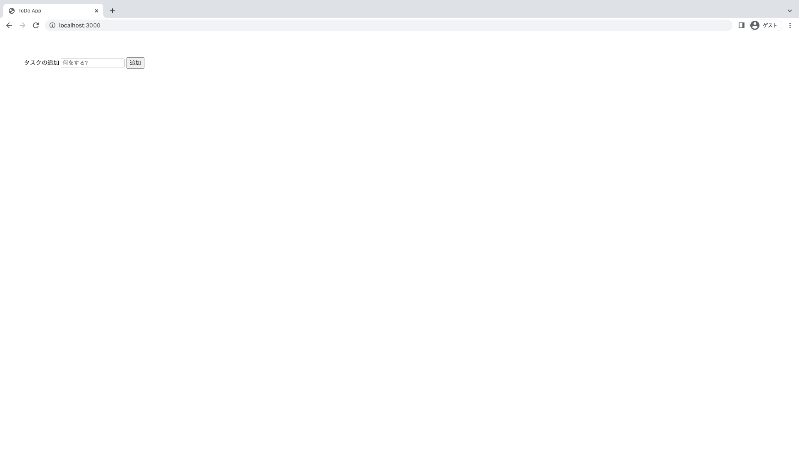

***
開発環境

Node.js(v16.16.0)

Mac OSX
***
## 1. Expressをインストール
開発するディレクトリに移動後
```bash
npm install express-generator -g
```
導入できたか確認
```bash
express -h
```
以下が表示されていれば大丈夫です。
```bash

  Usage: express [options] [dir]

  Options:

        --version        output the version number
    -e, --ejs            add ejs engine support
        --pug            add pug engine support
        --hbs            add handlebars engine support
    -H, --hogan          add hogan.js engine support
    -v, --view <engine>  add view <engine> support (dust|ejs|hbs|hjs|jade|pug|twig|vash) (defaults to jade)
        --no-view        use static html instead of view engine
    -c, --css <engine>   add stylesheet <engine> support (less|stylus|compass|sass) (defaults to plain css)
        --git            add .gitignore
    -f, --force          force on non-empty directory
    -h, --help           output usage information
```

## 2. テンプレートアプリケーションを作成
Expressを用いてテンプレートアプリを作成する
```bash
express --view=ejs todoapp
```
`todoapp`に移動
```bash
cd todoapp
```
npmパッケージをインストール
```bash
npm install
```
サーバを起動
```bash
npm start
```
[http:://localhost:3000/](http:://localhost:3000/)にアクセスする

無事に表示されていれば大丈夫です。

**app.js**
```js
const createError = require('http-errors');
const express = require('express');
const path = require('path');
const cookieParser = require('cookie-parser');
const logger = require('morgan');

const app = express();

// view engine setup
app.set('views', path.join(__dirname, 'views'));
app.set('view engine', 'ejs');

app.use(logger('dev'));
app.use(express.json());
app.use(express.urlencoded({ extended: false }));
app.use(cookieParser());
app.use(express.static(path.join(__dirname, 'public')));

app.use("/", require("./routes"));

// catch 404 and forward to error handler
app.use(function(req, res, next) {
  next(createError(404));
});

// error handler
app.use(function(err, req, res, next) {
  // set locals, only providing error in development
  res.locals.message = err.message;
  res.locals.error = req.app.get('env') === 'development' ? err : {};

  // render the error page
  res.status(err.status || 500);
  res.render('error');
});

module.exports = app;
```

**./routes/index.js**
```js
const express = require("express");
const router = express.Router();

let todos = [];

/* GET home page. */
router.get("/", function (req, res, next) {
    res.render("index", {
        title: "ToDo App",
        todos: todos,
    });
});

router.post("/", function (req, res, next) {
    const todo = req.body.add;
    todos.push(todo);
    res.render("index", { title: "ToDo App" });
    res.redirect("/");
});

module.exports = router;

```
**./view/index.ejs**
```html
<!DOCTYPE html>
<html>
<head>
    <title><%= title %></title>
    <link rel='stylesheet' href='/stylesheets/style.css' />
</head>
<body>
    <form action="/" method="post">
        <label>タスクの追加</label>
        <input required type="text" name="add" placeholder="何をする?" />
        <input type="submit" value="追加" />
    </form>
    <ul>
        <% for( let todo of todos ) { %>
            <li><span><%= todo %></span></li>
        <% } %>
    </ul>
</body>
</html>

```


### 参考
https://zenn.dev/wkb/books/node-tutorial/viewer/todo_03

